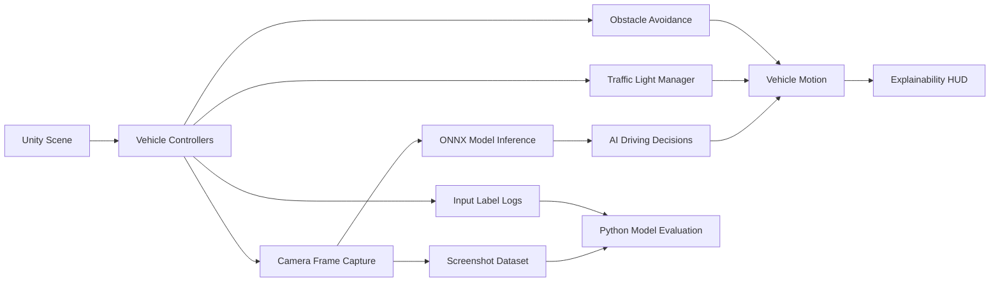

<div align="center">

# Explainable Vehicle Trajectory Prediction

### A Unity-based autonomous driving simulation with ONNX inference, traffic-aware vehicle control, and real-time explainability.

[](https://unity.com/)
[](https://onnx.ai/)
[](https://git-lfs.com/)
[](#version-control-notes)

[Project Setup](PROJECT_SETUP.md) | [Quick Start](#quick-start) | [Model Evaluation](#model-evaluation) | [Core Scripts](#core-scripts)

</div>

---

## Overview

**Explainable Vehicle Trajectory Prediction** is a Unity 6 project that simulates vehicle movement in a city-night driving environment. It combines player-controlled driving, AI traffic, ONNX model inference, rule-based safety systems, and a live explainability overlay that helps inspect why vehicles accelerate, brake, steer, or react to their surroundings.

The project is designed as an interactive testbed for autonomous-driving behavior, model evaluation, and transparent decision monitoring.

## Key Features

| Area | What It Provides |
| --- | --- |
| Vehicle Simulation | Wheel-collider driving, player controls, AI path following, braking, steering, and recovery logic. |
| ONNX Inference | Unity Inference Engine integration for model-driven vehicle behavior. |
| Explainability HUD | Real-time telemetry, braking context, traffic-light state, nearby-object risk, and driving signals. |
| Traffic System | Runtime traffic-light spawning, phase handling, red-light detection, and vehicle signal assignment. |
| Obstacle Avoidance | Vehicle and building detection with lane-aware steering and emergency braking behavior. |
| Data Capture | Screenshot and keyboard-label logging for training or evaluating driving models. |
| Offline Evaluation | Python utility for ONNX model benchmarking with exact-match accuracy and macro F1 metrics. |

## Demo Scene

```text
Assets/Scenes/City_night.unity
```

Open this scene in Unity to explore the full city-driving setup with the player car, AI vehicles, traffic-light logic, ONNX inference, and explainability monitor.

## System Flow



## Repository Structure

```text
Assets/
  AI_model/                         ONNX models and local data-capture output path
  Materials/                        Project materials and road physics assets
  Prefabs/                          Player car, AI car, and collider prefabs
  Scenes/                           Main Unity scenes
  Scripts/                          Vehicle, inference, traffic, data, and HUD scripts
  ARCADE - FREE Racing Car/         Vehicle art assets
  Versatile Studio Assets/          City environment assets

Packages/
  manifest.json                     Unity package dependencies
  packages-lock.json                Locked package versions

ProjectSettings/
  ProjectVersion.txt                Unity editor version
  *.asset                           Project-wide Unity settings

tools/
  evaluate_onnx_models.py           Offline ONNX model evaluation utility
```

## Requirements

| Dependency | Version / Notes |
| --- | --- |
| Unity Editor | `6000.3.8f1` recommended |
| Git LFS | Required for ONNX models, FBX assets, lightmaps, and large Unity binaries |
| Python | `3.9+`, only needed for offline model evaluation |
| Python Packages | `numpy`, `pillow`, `onnxruntime` |

## Quick Start

For a complete installation walkthrough, troubleshooting notes, and first-run checklist, see [PROJECT_SETUP.md](PROJECT_SETUP.md).

```bash
git lfs install
git clone https://github.com/kirangautham-82899/Explainable-Vehicle-Trajectory-Prediction.git
cd Explainable-Vehicle-Trajectory-Prediction
git lfs pull
```

Then:

1. Open the project folder in Unity Hub.
2. Use Unity Editor `6000.3.8f1` or a compatible Unity 6 release.
3. Open `Assets/Scenes/City_night.unity`.
4. Press Play.
5. Use the player car and observe the live explainability panel.

## Controls

| Input | Action |
| --- | --- |
| `W` / Up | Accelerate |
| `S` / Down | Reverse or brake input |
| `A` / Left | Steer left |
| `D` / Right | Steer right |
| `Space` | Brake |
| `M` | Toggle explainability monitor |

## Core Scripts

| Script | Purpose |
| --- | --- |
| `Assets/Scripts/onnxcontroller.cs` | Runs ONNX inference, captures camera frames, follows paths, and handles AI driving responses. |
| `Assets/Scripts/CarController.cs` | Handles player wheel-collider driving, braking, steering, and red-light stopping. |
| `Assets/Scripts/AICarConroller.cs` | Controls non-ONNX AI path following, obstacle avoidance, and recovery behavior. |
| `Assets/Scripts/TrafficLightManager.cs` | Spawns traffic lights, manages signal assignment, and exposes nearest-red-light queries. |
| `Assets/Scripts/TrafficLight.cs` | Represents traffic-light state and phase timing. |
| `Assets/Scripts/TrafficTriggerZone.cs` | Detects vehicles entering traffic-control zones. |
| `Assets/Scripts/PlayerExplainableMonitor.cs` | Draws the real-time explainability overlay for telemetry and risk inspection. |
| `Assets/Scripts/DataCollection_1.cs` | Captures screenshots and keyboard labels for model data collection. |
| `Assets/Scripts/TrainDataCollection.cs` | Supports training-data collection workflows. |
| `Assets/Scripts/SpeedometerUI.cs` | Displays vehicle speed in the UI. |
| `Assets/Scripts/CameraFollow.cs` | Keeps the camera aligned with the driving target. |
| `Assets/Scripts/Path.cs` | Defines path-related editor/runtime behavior. |

## AI Models

Tracked ONNX models are stored in:

```text
Assets/AI_model/
```

Included models:

| Model | Role |
| --- | --- |
| `game_ai_model.onnx` | Primary AI driving model. |
| `game_cnn.onnx` | CNN-based driving model. |
| `game_sequence_cnn.onnx` | Sequence-aware CNN model for temporal driving context. |

## Data Capture

The project can collect screenshot frames and keyboard-control labels during play mode.

Generated data paths:

```text
Assets/AI_model/Screenshots/
Assets/AI_model/Input_Data.txt
```

These files are intentionally ignored by Git because local capture sessions can grow into gigabytes of data. The repository keeps the folder placeholder, but not the generated dataset.

## Model Evaluation

Install the Python evaluation dependencies:

```bash
python3 -m pip install numpy pillow onnxruntime
```

Run evaluation after collecting local labels and screenshots:

```bash
python3 tools/evaluate_onnx_models.py \
  --labels Assets/AI_model/Input_Data.txt \
  --screenshots Assets/AI_model/Screenshots \
  --models Assets/AI_model/game_ai_model.onnx Assets/AI_model/game_sequence_cnn.onnx
```

The evaluator reports:

- Aligned sample count
- Label positive rate
- Best threshold
- Exact-match accuracy
- Macro F1
- Per-key accuracy
- Per-key F1

## Git LFS and Large Assets

This repository uses Git LFS for large binary assets, including:

- ONNX model files
- FBX meshes
- EXR lightmaps
- Large Unity lighting data

If large files appear as tiny pointer files after cloning, run:

```bash
git lfs pull
```

## Version Control Notes

The `.gitignore` is tuned for Unity projects. It excludes generated and machine-local files such as:

```text
Library/
Temp/
Obj/
Build/
Builds/
Logs/
UserSettings/
Assets/AI_model/Screenshots/
Assets/AI_model/Input_Data.txt
```

This keeps the repository focused on source assets, project settings, scripts, models, and reproducible configuration.

## Suggested Workflow

1. Pull the latest repository state.
2. Open the Unity project and make scene/script changes.
3. Avoid committing generated `Library`, `Logs`, or screenshot data.
4. Track new large binary assets with Git LFS when needed.
5. Validate the scene in Unity before pushing.

## Project Summary

This project brings together simulation, model inference, safety logic, and explainability into one Unity environment. It can be used to experiment with trajectory prediction, inspect AI-driving behavior, collect new datasets, and compare ONNX driving models against real captured inputs.
